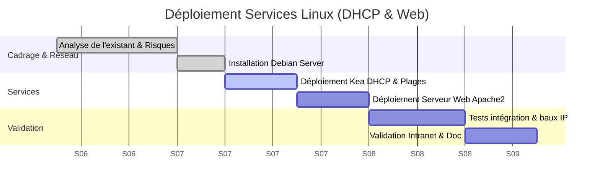

# RP04 - Services d'infrastructure Linux (DHCP & Web)

> 🌐 **Aperçu Visuel :** Retrouvez une présentation illustrée de ce projet sur mon portfolio : [edib16.github.io/Portfolio/#RP04](https://edib16.github.io/Portfolio/#RP04)

> **Auteur :** Edib Saoud
> **Date :** 02/2025 - 03/2025
> **Contexte :** Projet BTS SIO SISR - IRIS Mediaschool

## 1. Contexte du Projet

Ce projet a été réalisé afin de répondre à deux besoins critiques de l'infrastructure de l'école :
1. **L'adressage IP des postes clients** était fastidieux et source de conflits d'adresses. Il fallait automatiser ce processus.
2. L'absence d'une plateforme d'échange centralisée justifiait le déploiement d'un **Intranet pédagogique** accessible localement.

L'objectif (SISR) était de concevoir et déployer un serveur Linux unique hébergeant les rôles **DHCP (Kea)** et **Web (Apache2)**, tout en assurant leur coexistence et leur fiabilité.

## 2. Sommaire de la Documentation

1. [Dossier de Choix Technique](01_DOSSIER_CHOIX_TECHNIQUE.md) : Justification des choix technologiques (Debian, Kea DHCP, Apache2).
2. [Procédure d'Installation](02_PROCEDURE_INSTALLATION.md) : Déploiement des services, création de l'étendue IP et configuration Web.
3. [Mode Opératoire](03_MODE_OPERATOIRE.md) : Commandes d'administration courante et lecture des journaux (logs).
4. [Cahier de Recette](04_CAHIER_DE_RECETTE.md) : Tests d'attribution IP dynamique et vérification de l'accès intranet.

## 3. Compétences SISR Mobilisées (Blocs BTS SIO)

| Bloc de Compétences | Compétences spécifiques validées dans ce projet | Preuves / Exemples concrets |
|:---|:---|:---|
| **Bloc 1 : Support et mise à disposition de services informatiques** | **Gérer le patrimoine informatique** | Administration d'un environnement Linux (Debian) et déploiement de rôles réseaux. |
| | **Mettre à disposition un service informatique** | Paramétrage d'un serveur Web Apache2 (Intranet) et automatisation de l'adressage (DHCP). |
| | **Répondre aux incidents et demandes d'assistance** | Mise en place de journaux d'erreurs (logs DHCP/Apache) pour le diagnostic. |
| **Bloc 3 : Cybersécurité des services informatiques** | **Protéger l'infrastructure de l'organisation** | Isoler et sécuriser les baux DHCP par des réservations d'adresses MAC pour les postes critiques. |

## 4. Planning de Réalisation (Diagramme de Gantt)

Le projet s'est déroulé en totale autonomie sur un cycle de 3 semaines (Cycle en V) :

